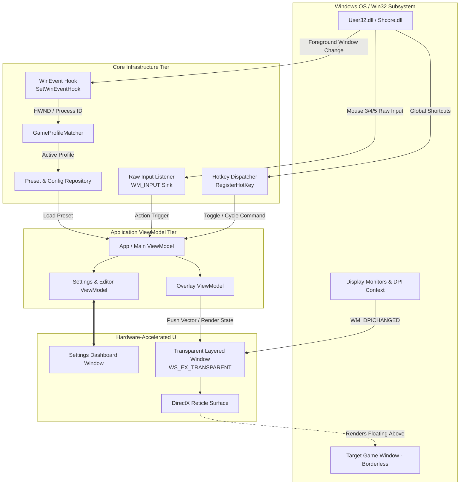

# CrossGOverlay

> An ultra-lightweight, high-performance, and anti-cheat safe custom crosshair overlay designed for Windows desktop environments.

[-0078D6?logo=windows&logoColor=white)](#5-installation)
[](https://dotnet.microsoft.com/download/dotnet/8.0)
[](#4-overall-architecture)
[](#anti-cheat-safety-guarantee)
[](LICENSE)

---

## 1. Title & Description

**CrossGOverlay** is a professional-grade, hardware-accelerated Windows crosshair overlay engineered for competitive precision and maximum performance. Built from the ground up on modern **.NET 8** and **WPF**, it delivers pixel-perfect reticle rendering over borderless windowed games without triggering intrusive anti-cheat telemetry or adding measurable input latency.

Designed as an open, clean-room alternative to proprietary utilities like Crosshair X, CrossGOverlay couples low-overhead OS-level hooks with real-time profile switching, extensive procedural reticle customization, and full crosshair share-code portability between mainstream titles (such as Counter-Strike 2 and Valorant).

---

## 2. Introduction

Competitive gaming demands visual consistency. However, native in-game crosshairs often suffer from dynamic spread jitter, low visibility against shifting background palettes, or restrictive engine customization limits. Hardware monitors offering built-in overlay crosshairs provide poor alignment, rigid shapes, and clunky on-screen display (OSD) button controls.

**CrossGOverlay** solves this by establishing a zero-interference, borderless transparent overlay window that floats over your target application. Utilizing standard Win32 desktop composition primitives (`WS_EX_TRANSPARENT`, `WS_EX_LAYERED`, `WS_EX_NOACTIVATE`), CrossGOverlay guarantees that mouse inputs pass cleanly through to the game loop. The application runs strictly in unprivileged user mode (`asInvoker`), never hooks game APIs, never inspects game process memory, and operates cleanly alongside aggressive kernel-level anti-cheat platforms such as Riot Vanguard, Easy Anti-Cheat (EAC), and BattlEye.

---

## 3. Key Features

- **Anti-Cheat Safe by Design**: Operates purely as an external OS window. Strictly no DLL injection, no kernel drivers, no synthetic input simulation, and no memory reads/writes.
- **Bi-directional Share-Code Engine**:
  - **Counter-Strike 2**: Full base64-encoded procedural bitpack parsing (`CSGO-xxxxx-xxxxx-...`).
  - **Valorant**: Native 1:1 format serialization and deserialization (`0;P;c;...`).
  - **Validation & Sanity Previews**: Immediate visual verification dialog preventing malformed shares.
- **High-Performance Rendering**: WPF DirectX hardware-accelerated composition with sub-millisecond redraw intervals and fluid high-refresh-rate rendering (144Hz, 240Hz, 360Hz+).
- **Per-Monitor V2 DPI Awareness**: Seamless dynamic scaling across multi-monitor setups with disparate scale factors (e.g., 100% vs. 150% scaling) and hot-plug display recovery.
- **Automatic Game Profile Matching**: Dynamically switches reticle presets when specified game processes or window titles enter the foreground via low-overhead `SetWinEventHook` notifications.
- **Passive Global Hotkeys & Raw Input**: Global shortcuts using `RegisterHotKey` and auxiliary mouse buttons (Mouse 3, 4, 5) mapped via `WM_INPUT` (`RIDEV_INPUTSINK`).
- **Engineered Dark Design Language**: Handcrafted UI built on the MongoDB LeafyGreen aesthetic (`#001E2B` deep slate, `#00ED64` neon accents) with hot-swappable English and Vietnamese localization.

---

## 4. Overall Architecture

CrossGOverlay implements a decoupled **Model-View-ViewModel (MVVM)** pattern combined with an asynchronous event-driven Win32 interaction tier.

### System Topology & Interaction Flow



### Architectural Directives & Safety Guarantees

#### Anti-Cheat Safety Guarantee
CrossGOverlay uses only standard, documented Windows User APIs:
- Process introspection is limited strictly to `GetWindowThreadProcessId` and `QueryFullProcessImageNameW` to match window profile names.
- The overlay is marked with `WS_EX_TRANSPARENT | WS_EX_LAYERED | WS_EX_NOACTIVATE`, which instructs the Desktop Window Manager (DWM) to route all mouse and pointer clicks directly through the window to the underlying application.
- Hook operations never employ invasive `WH_KEYBOARD_LL` or `WH_MOUSE_LL` intercepts that anti-cheat heuristics track.

#### Single-Instance Mutex
Process deduplication is managed via an operating-system-level `System.Threading.Mutex`. Attempting to launch a secondary instance signals the primary instance's system tray handler and brings the active Settings window to the foreground.

---

## 5. Installation

### System Requirements

| Component | Minimum Requirement | Recommended |
|---|---|---|
| **OS** | Windows 10 (Version 1607+) x64 | Windows 11 x64 (Latest Build) |
| **Execution** | None (Self-contained release) | [.NET 8 Desktop Runtime](https://dotnet.microsoft.com/download/dotnet/8.0) |
| **Building** | [.NET 8.0 SDK](https://dotnet.microsoft.com/download/dotnet/8.0) | Visual Studio 2022 (v17.8+) |
| **Execution Level** | Standard User (`asInvoker`) | Standard User (`asInvoker`) |

### Option A: Pre-Compiled Release (Recommended)

1. Navigate to the project's **[Releases](../../releases)** tab.
2. Download the latest self-contained archive: `CrossGOverlay-<version>-win-x64.zip`.
3. Extract the `.zip` archive to your directory of choice (e.g., `C:\Tools\CrossGOverlay`).
4. Execute `CrossGOverlay.exe`.

> **Note:** Official builds are bundled as self-contained ReadyToRun binaries. The host machine does not need .NET 8 pre-installed.

### Option B: Building from Source

Clone the repository recursively:
```bash
git clone https://github.com/your-username/CrossGOverlay.git
cd CrossGOverlay
```

Restore dependencies and build the solution:
```bash
dotnet restore Crosshair.sln
dotnet build Crosshair.sln -c Release
```

---

## 6. Running the Project

### Running via .NET CLI
```bash
# Debug mode with console logging
dotnet run --project src/CrosshairOverlay/CrosshairOverlay.csproj -c Debug

# Optimized release binary execution
dotnet run --project src/CrosshairOverlay/CrosshairOverlay.csproj -c Release
```

### Automated Release Packaging Pipeline
To run the automated packaging pipeline that executes clean builds, embedded dependency generation, ReadyToRun optimization, and zip packaging:

```powershell
# Standard package generation
.\build\publish.ps1

# Package with digital code-signing applied
.\build\publish.ps1 -PfxPath "C:\certs\code_signing.pfx" -PfxPassword (Read-Host -AsSecureString)
```
The distribution directory and standalone archive will be placed in `artifacts\CrossGOverlay-<version>-win-x64.zip`.

### Default Keybindings

| Key Combination | Action | Description |
|---|---|---|
| `Alt + X` | **Toggle Overlay** | Shows or hides the reticle surface globally. |
| `Alt + ]` | **Next Reticle** | Cycles forward through your local preset library. |
| `Alt + [` | **Previous Reticle** | Cycles backward through your local preset library. |
| `Alt + C` | **Open Settings** | Displays the reticle configuration workspace. |
| `Mouse 3 / 4 / 5` | **User Assignable** | Auxiliary mouse buttons supported via Raw Input. |

---

## 7. Environment & Storage Configuration

CrossGOverlay operates on an isolated file-system configuration model rooted in standard Windows system paths. It does not write to the Windows Registry for reticle settings or user preferences.

### System File Paths

```
%APPDATA%\CrosshairOverlay\
├── settings.json              <-- Core config, hotkeys, game-process profiles
└── presets\                   <-- User and community reticle presets
    ├── default.json
    ├── dot.json
    └── competitive_cross.json

%LOCALAPPDATA%\CrosshairOverlay\
└── logs\                      <-- Rolling application logs (auto-pruned after 7 days)
```

### Configuration Schema: `settings.json` Example
```json
{
  "General": {
    "Language": "en-US",
    "StartWithWindows": false,
    "HideInExclusiveFullscreenWarning": true
  },
  "Hotkeys": {
    "ToggleOverlay": "Alt + X",
    "NextPreset": "Alt + OemCloseBrackets",
    "PreviousPreset": "Alt + OemOpenBrackets",
    "OpenSettings": "Alt + C"
  },
  "GameProfiles": [
    {
      "ProfileName": "Counter-Strike 2",
      "ProcessName": "cs2.exe",
      "WindowTitle": "Counter-Strike 2",
      "PresetId": "competitive_cross",
      "MatchByTitleOnly": false
    }
  ]
}
```

---

## 8. Folder Structure

```
CrossGOverlay/
├── .github/                      # CI/CD workflows, issue templates
├── build/                        # Automation & deployment scripts
│   ├── publish.ps1               # Automated release packaging pipeline
│   └── sign.ps1                  # Authenticode code-signing utility
├── src/
│   └── CrosshairOverlay/         # Primary application project (WPF / .NET 8)
│       ├── Common/               # Global enumerations, helper utilities
│       ├── Interop/              # Native Win32 P/Invoke APIs (User32, Shcore)
│       ├── Models/               # Reticle models, configurations, share codes
│       ├── Native/               # Raw input sinks, WinEvent hook abstractions
│       ├── Resources/            # LeafyGreen XAML styles, icon vectors
│       │   ├── Localization/     # Strings.resx, Strings.vi.resx
│       │   └── Theme.xaml        # Core styling specifications
│       ├── Services/             # Profile matchers, preset persistence, hotkeys
│       ├── ViewModels/           # MVVM ViewModels coordinating state
│       ├── Views/                # XAML Windows (Overlay, Settings Dashboard)
│       ├── App.xaml              # Application composition root & DI
│       └── CrosshairOverlay.csproj
├── tests/
│   └── CrosshairOverlay.Tests/   # Unit & functional validation suites (xUnit)
│       ├── Cs2ShareCodeTests.cs
│       ├── ValorantCodeTests.cs
│       ├── GameProfileMatcherTests.cs
│       └── PresetRepositoryTests.cs
├── ARCHITECTURE.md               # Detailed technical design specifications
├── Crosshair.sln                 # Visual Studio solution file
├── LICENSE                       # MIT licensing declaration
└── README.md                     # Project documentation root
```

---

## 9. Contribution Guidelines

Contributions are welcome from the community. To keep code quality consistent across the codebase, please review the following engineering standards:

### Development Workflow
1. **Fork & Branch**: Create a feature branch off `main` with a standard naming convention:
   ```bash
   git checkout -b feat/dynamic-spread-indicator
   # or: git checkout -b fix/multimonitor-dpi-offset
   ```
2. **Coding Standards**:
   - Write clean, idiomatically typed C# 12 code adhering to standard .NET framework conventions.
   - P/Invoke signatures must strictly define safe native marshaling types with explicit CharSet parameters (`CharSet.Unicode`).
   - Retain full MVVM separation: No UI orchestration inside raw models; rely on data bindings, commands, and dependency injection.
3. **Localization Support**:
   - Never hardcode user-visible strings inside views or models. Add string values to `Strings.resx` (en-US default) and `Strings.vi.resx` (Vietnamese).
4. **Automated Verification**:
   - Run the test suite before opening a pull request. Every unit test must pass:
   ```bash
   dotnet test Crosshair.sln -c Release
   ```
5. **Pull Request Protocol**:
   - Submit clear, well-described PRs referencing relevant issue IDs. Include visual screenshots or animated captures for UI changes.

---

## 10. License

CrossGOverlay is licensed under the open-source **[MIT License](LICENSE)**.

```
Copyright (c) 2026 CrossGOverlay Contributors

Permission is hereby granted, free of charge, to any person obtaining a copy
of this software and associated documentation files (the "Software"), to deal
in the Software without restriction, including without limitation the rights
to use, copy, modify, merge, publish, distribute, sublicense, and/or sell
copies of the Software, and to permit persons to whom the Software is
furnished to do so, subject to the following conditions:

The above copyright notice and this permission notice shall be included in all
copies or substantial portions of the Software.
```

---

## 11. Roadmap

- [x] **v1.0.0 — Core Foundation**
  - [x] WPF .NET 8 layered transparent overlay window implementation.
  - [x] Full CS2 and Valorant crosshair code import and export parser.
  - [x] Game profile matching via Windows foreground hooks.
  - [x] MongoDB LeafyGreen dark UI system and full Vietnamese/English localization.
- [ ] **v1.1.0 — Extended Graphics Engine**
  - [ ] DirectComposition / Direct2D hardware swap-chain rendering support for reduced CPU usage.
  - [ ] Dynamic crosshair spread profiles (timer/movement simulation presets).
  - [ ] Custom image and SVG reticle asset importing.
- [ ] **v1.2.0 — Ecosystem & Community**
  - [ ] Community reticle gallery browser with one-click direct import.
  - [ ] Auto-detection support for Apex Legends and Overwatch 2 crosshair formats.
  - [ ] Cloud-synced profile backups via secure webhooks or GitHub Gist integration.

---

## Acknowledgements

Special thanks to **[HuuwxLoiwf (HuuLoii)](https://github.com/HuuwxLoiwf)** for architectural collaboration, game-profile testing, and core contributions to the project ecosystem.